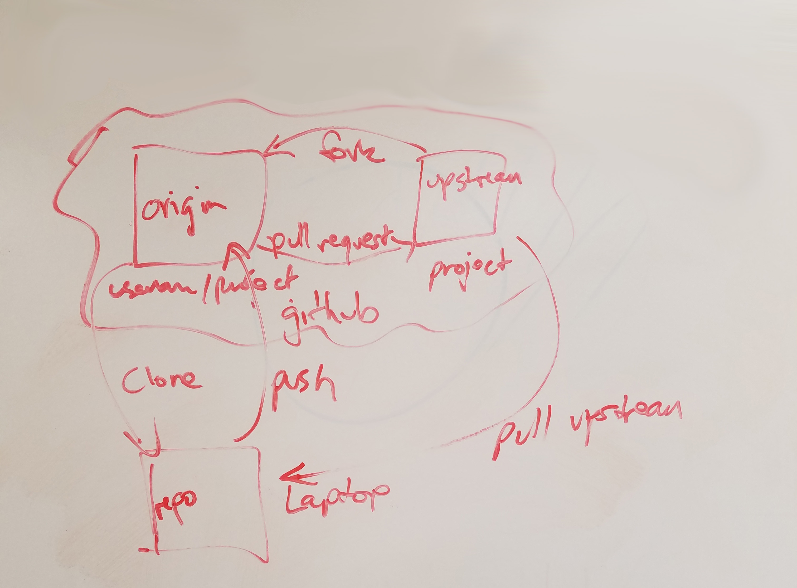

# Learning Open Source

## Week 1
I spent today reading through guides on gettings started contributing to open source projects. I learned that most projects that are set up for new contributors have a file called CONTRIBUTING, which has guidelines for how you can get involved and the project lead's required format for pull requests. 

I also went through the lists of open source projects that are beginner friendly, and found a few that look like a good fit. For my first pull request, I'm going to contribute to [one of these lists](https://github.com/vredniy/awesome-awesomeness). All you need to contribute is a link that isn't already on one of the lists and the knowledge to create a pull request, which has clear guidelines in their CONTRIBUTING file. So, this first pull request can be all about following the steps to make a pull request, and future pull requests can then move into how to follow guidelines for code. It does look like I could contribute to more than one list after browsing through them during class, but I'd like to shoot for more substantial pull requests for the other three that I need to complete Hacktoberfest.

Another project that I identified is [yoda](https://github.com/yoda-pa/yoda), a personal assistant that lives in the command line. I think this is a good candidate for three reasons: 
 1. It's written in Python, which I'm already familiar with.
 2. It sounds like something I'd use, which is the conventional wisdom on the best projects to contribute to. 
 3. It's set up so that you can contribute a single "skill," or feature, which will let me make a self-contained pull request.

After reading through a bunch of CONTRIBUTING documentation, I feel like I have a much better handle on what's generally expected. I also feel a little like an idiot for not knowing those existed, but I'm a lot more comfortable now that I know that those signal projects that are receptive to contributions. It's a little intimidating to make a pull request that no one has asked for (which was not the case with the open source project that I'm working on with Open Austin, which is made up of people that I've met in real life). Now that I know I can look for CONTRIBUTING docs, I feel like I've started to get my feet under me on how open source works and how to best make a pull request that will be welcomed.

## Week 2
I'm trying to contribute this line to the [awesome-newsletters](https://github.com/vredniy/awesome-newsletters) list:
 * [Best in Visual Storytelling](http://tinyletter.us16.list-manage1.com/subscribe?u=5c12dabe1e59a9fbde1174b8c&id=e27a48af53). Monday roundup of the best in data journalism from the past week. Paid version also includes data visualization job postings.

I promptly broke everything.
 * made a clone and a branch without forking first
 * did not realize that was a thing until I made my commit and was trying to figure out how to push it to someone else's repo
 * there are lots of things telling you how to do something correctly, but none telling you how to fix something you broke (or they're way harder to find)
 * if you try to burn everything to the ground and start over by deleting the directory, git will follow you straight into the trash
 * googling "unfuck git" [actually works](http://ohshitgit.com/)
 * added bonus of choosing a really easy contribution for my first PR: I could stick my one-line contribution here temporarily, and it's no big deal to add back to the file. So, I now know what NOT to do ever again, without a huge loss of work.

I started over, following [these instructions](https://www.digitalocean.com/community/tutorials/how-to-create-a-pull-request-on-github) and referencing the [GitHub documentation](https://help.github.com/articles/configuring-a-remote-for-a-fork/) as needed. It worked! I made a pull request. But it failed the continuous integration checks. It looks like [other pull requests](https://github.com/vredniy/awesome-newsletters/pulls?q=is%3Apr+is%3Aclosed) have been merged after failing, and the Travis log suggests the failure wasn't because of my addition. It looks like pull requests are typically reviewed the same day, so hopefull I'll know soon whether I need to redo anything.

**Update**: my pull request was approved right before class ended! I've officially reached my simple goal, and am super validated as far as my ability to figure out where and how to contribute.

For my own reference, here are the basic steps to contribute to a project in plain English:
 1. Fork the repo.
 2. Clone that new repo to your local machine.
 3. Make a branch.
 4. Make your changes.
 5. Commit to your branch.
 6. Push to your branch.
 7. Set the orginal repo as `upstream`.
 8. Make sure you're up to date with the upstream repo.
 9. Go to the original repo.
 10. Make a new pull request.

I did these steps slightly out of order because I was referencing multiple guides (I did 7 and 8 before 3), but got to the same final result. In the future, I think the above order is better, since there's less risk of pushing upstream before you're ready, which is still a concern as I bumble around git.

I definitely have a lot to learn about how all of this works, but finding [Oh shit, git!](http://ohshitgit.com/) made it clear that git can be frustrating no matter what your skill level is, which helped me put myself in context within the community of practice. Also, [this blog](http://bryanpendleton.blogspot.com/2014/07/git-clone-vs-fork.html) has a helpful explaination of what's 'forking' and 'cloning' and how they're different, which was my main source of frustration today.

I also came across [this guide](http://dont-be-afraid-to-commit.readthedocs.io/en/latest/index.html), which covers virtualenv (which is used by yoda, the next project I'm planning to try contributing to).

## Week 3

At the beginning of class today, I spoke with Dr. Howison about why I like [this guide](https://www.digitalocean.com/community/tutorials/how-to-create-a-pull-request-on-github):
  * It has more explanation of what's going on than most other guides (vs. just type these things in this order).
  * It provides an introduction of each command with explanation, *then* the shortcut to smush them together. Separate commands are frequently mentioned as an aside after the shortcut, if they're mentioned at all. While that order is efficiencnt for people trying to just move on to the next step, it doesn't support understanding the git workflow or building a mental model of what's going on.

I also learned that a "diff" is a separate file containing only the changed lines, and not just the term for color coding what changed with green for additions and red for deletions. I didn't get to it today, but should look into further explanations of the concept.

We also constructed a diagram of where the fork vs. clone vs. local repo live and how they communicate:

After struggling with the fuzziness around those terms last week, it was really helpful to see them laid out in relation to one another and solidfy my mental model. I'm surprised that there aren't more readily available diagrams of this workflow included in explanations of the forking and cloning process.

To actually contribute to someone else's project, the technical side is only part of what you need to know--there's lots of stuff around community, culture, and how to be polite.

I already spent a fair amount of time poking around projects and reading through contributing guides, which feels like way more of a minefield than making a technical error. This observation ties back into the readings the class did on [communities of practice](https://en.wikipedia.org/wiki/Community_of_practice). In particular, [legitimate peripheral particpation](https://en.wikipedia.org/wiki/Legitimate_peripheral_participation) takes the form of [asking good questions](http://www.catb.org/esr/faqs/smart-questions.html).

As a part of open souce projects, questions should be asked in the open. Since they can be viewed as a preliminary means of contributing to the community, equal care should be taken with questions as with pull requests. Mostly, be respectful of other people's time by making a real effort to figure it out yourself and asking questions that are interesting to answer. These kinds of questions give back to the community by either furthering everyone's understanding or producing documentation about how to solve a particular issue.

